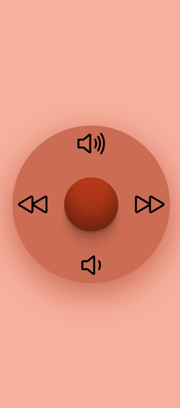

# Lazy controller



A web application (for mobile) to allow lazy users to control the playback of videos remotely. Users are able to: 

- Pause/Play
- Go forward/backwards
- Increase/decrease volume

## Details

Lazy controller uses socket.io to establish a connection between the host machine and the mobile client, allowing real-time control. Note that it does not manipulate videos directly, but rather, inputs keystrokes into the host machine. 

## Setup

Both frontend and backend instances must be running. Importantly, the backend instance must be running on the main operating system (ie. backend cannot be running on WSL or a virtual machine).

The setup below assumes that you are running this over the LAN. Alternatively, localtunnel can be used to expose your server to the public.

### Installation

Packages for both front and backend are managed by `npm`. Run `npm install` to install dependencies. For backend, take not of installation of `Robotjs` which may not be straightforward. Refer to the `Robotjs` docs for info.

### Ports

By default, the frontend listens on port 3000 and the backend listens on port 8080. Open these ports on your firewall.

### Port forwarding to WSL

If frontend is running on WSL, in order for the frontend to be reachable over the LAN, traffic must be forwarded from the Windows IP to the WSL IP address. Instructions to do this can be found here: https://stackoverflow.com/questions/61002681/connecting-to-wsl2-server-via-local-network.

### Environment variables

#### Backend
 
The backend server expects the `HOST` environment variable. This is simply the IP address of the host machine.

#### Frontend

The frontend server expects the `REACT_APP_BACKEND_URL` environment variable. Provide the URL to reach the backend server. 

### Setup scripts

#### `BackendSetup.ps1`

This script assumes that the frontend is on WSL, and does the necessary port forwarding as indicated above. It also sets the `HOST` environment variable. Run it using: 

```
./BackendSetup.ps1
```

#### `FrontendSetup.sh`

This script sets the env var `REACT_APP_BACKEND_URL`. Run it using: 

```
source ./FrontendSetup.sh
```